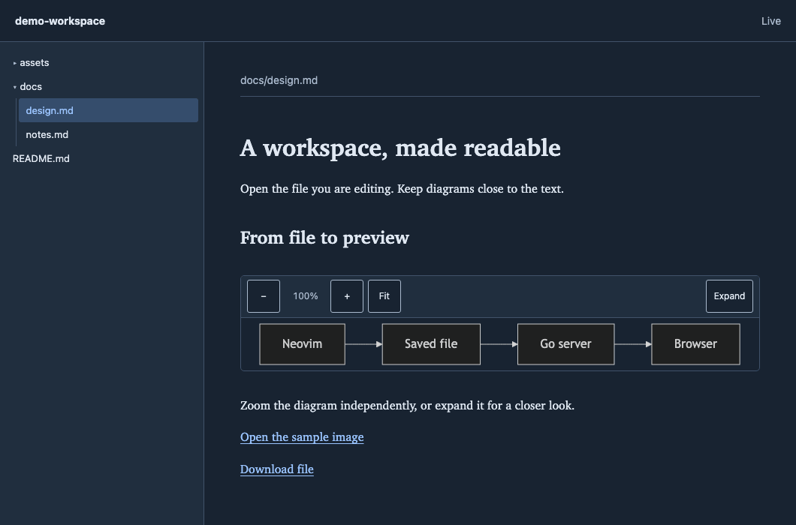

# media-glance.nvim

**Read your workspace in a browser without leaving your Neovim workflow.** Preview Markdown, Mermaid diagrams,
images, and other media beside a file explorer, with live updates from saved changes made by any editor or agent.

media-glance.nvim pairs a Lua plugin with a local Go server. Install its prebuilt binary once; the viewer bundles
its browser interface and Mermaid renderer. Opening a preview works offline for local files and needs no Node.js
or Go toolchain.

## Demo



The demo opens the selected document beside its explorer, enlarges the Mermaid diagram, and closes its expanded
view. Another process saves the document; the preview updates automatically. A local SVG then opens in the viewer.
All sample content is invented. See the [recording details](docs/assets/README.md) or follow the
[first-preview tutorial](docs/tutorials/preview-your-first-document.md) at your own pace.

## Highlights

- **Start with the file you are editing.** Open your current saved file and reveal it in the explorer sidebar.
- **Read rich documents.** Render Markdown tables, task lists, local images, links, and Mermaid diagrams.
- **Enlarge the media, keep the text size.** Zoom each image or diagram, fit it, or open an expanded view.
- **See changes from outside Neovim.** Saved and atomic file replacements refresh the preview.
- **Keep sessions independent.** Each Neovim session owns its server; exiting the editor stops it. Pick a running
  server to reopen it or stop it explicitly.

## Install

You need **Neovim 0.10 or later**, a browser, and **macOS or Linux on arm64 or amd64**. Explicit binary installation
also needs `curl` and either `shasum` or `sha256sum`. Windows is not supported.

Add this [lazy.nvim](https://lazy.folke.io/spec) spec to your plugin configuration:

```lua
{
  "wahidyankf/media-glance",
  tag = "v0.1.0",
  lazy = false,
  main = "media-glance",
  opts = {},
}
```

Install the plugin with your plugin manager, restart Neovim, then run:

```vim
:MediaGlanceInstall
```

The installer downloads the binary for your platform from the matching release, verifies its SHA-256 checksum
and version/protocol, and publishes it atomically in Neovim's cache. Installation is explicit: opening or listing
previews never downloads or builds anything. See [installation and upgrades](docs/how-to/install-and-upgrade.md)
for source builds and recovery from an interrupted installation.

## First preview

Open Neovim from the directory you want to browse, open a saved file inside it, and run:

```vim
:MediaGlanceOpen
```

The browser opens that file with the workspace explorer on the left. Save a change to the file, or let another
process update it: the preview refreshes while preserving document scroll and relevant media zoom.

| Command               | Action                                                                 |
| --------------------- | ---------------------------------------------------------------------- |
| `:MediaGlanceOpen`    | Start or reuse this session's server and open the current saved file.  |
| `:MediaGlanceList`    | Pick a server and open your current file when it belongs to that root. |
| `:MediaGlanceClose`   | Pick a running server and stop it.                                     |
| `:MediaGlanceInstall` | Download and verify the binary matching this plugin version.           |

With common picker providers, Enter confirms and Escape cancels. Server pickers use `vim.ui.select`; an installed
UI provider can supply the picker. The plugin creates no default keybindings. For example, add these mappings
after plugin setup:

```lua
local media = require("media-glance")
vim.keymap.set("n", "<BS>wvmo", media.open, { desc = "Open workspace media" })
vim.keymap.set("n", "<BS>wvml", media.list, { desc = "List workspace media" })
vim.keymap.set("n", "<BS>wvmx", media.close, { desc = "Close workspace media" })
```

[Preview your first document](docs/tutorials/preview-your-first-document.md) walks through diagrams, external
updates, zoom, and cleanup in a temporary workspace.

## Workspace and media behavior

By default, the workspace is Neovim's **global working directory**, captured when the server starts. Changing
Neovim's directory later does not move an existing server. An unnamed buffer, missing file, or file outside that
root falls back to the root's `README.md`, then the explorer. List selection captures your file before the picker
opens, so the picker buffer does not replace your intended preview.

Images and Mermaid diagrams have independent **−**, **+**, **Fit**, and **Expand** controls. Zoom ranges from
25% to 800% relative to fit; scroll inside enlarged media to explore it. Escape closes the expanded view and
returns focus. The document column allows up to 123ch without changing text size.

The sidebar loads folders as you expand them. Live updates watch the selected file, referenced local assets, and
visible directories rather than recursively indexing the entire workspace. The explorer skips `.git`,
`node_modules`, `.cache`, and `worktrees`. See [supported media and limits](docs/reference/preview-behavior.md)
for file types, browser codec requirements, and watcher limits.

## Configuration

```lua
require("media-glance").setup({
  root = function() return vim.fn.getcwd(-1, -1) end,
  state_dir = vim.fn.stdpath("state") .. "/media-glance",
  cache_dir = vim.fn.stdpath("cache") .. "/media-glance",
  -- binary = "/absolute/path/to/media-glance",
})
```

The defaults work without configuration. Use `root` to integrate your own workspace detection and `binary` for an
explicit source build. The Lua API exposes `setup`, `open`, `list`, `close`, `shutdown`, and `install`.
[Configuration and API reference](docs/reference/configuration-and-api.md) covers every option and command.

## Local access and lifecycle

Servers bind only to `127.0.0.1`, selecting an available port in **57300–57399** by binding it. Occupied ports are
skipped. Multiple editor sessions can serve different workspaces independently.

The server authenticates routes, validates host/origin headers, and confines file and symlink access to the workspace.
Raw Markdown HTML is escaped, and document scripts do not run. **Keep viewer URLs private:** they contain a session
access token. Anyone with a token and local access can read files in that workspace; the explorer's hidden folders
are not access restrictions. Remote images in documents can still contact their external hosts.

Closing a browser tab leaves its server available until you stop it or exit its owning Neovim session.
[How sessions and live updates work](docs/explanation/sessions-and-live-updates.md) explains ownership and cleanup.

## Documentation and support

Open `:help media-glance.nvim` inside Neovim, or browse the [documentation index](docs/README.md).

| Section                                   | Use it when                                                         |
| ----------------------------------------- | ------------------------------------------------------------------- |
| [Tutorials](docs/tutorials/README.md)     | You want a complete first preview.                                  |
| [How-to guides](docs/how-to/README.md)    | You need installation, workspace control, or troubleshooting steps. |
| [Reference](docs/reference/README.md)     | You need an exact option, command, file type, or limit.             |
| [Explanation](docs/explanation/README.md) | You want to understand sessions, watching, and access boundaries.   |

For a problem, start with [troubleshooting](docs/how-to/troubleshoot.md). Report reproducible issues through
[GitHub Issues](https://github.com/wahidyankf/media-glance/issues); include your platform, Neovim version, plugin tag,
and the error message. Remove viewer tokens and private workspace content from reports.

## Contributing and license

[CONTRIBUTING.md](CONTRIBUTING.md) covers native development tools, hooks, complete checks, and releases.
Go, Lua, and JavaScript each have an independent **99% unit coverage gate**, with separate integration, Neovim,
and browser tests. Changes reach `main` through pull requests with required CI.

media-glance.nvim is available under the [MIT license](LICENSE). Bundled dependency notices are in
[THIRD_PARTY_NOTICES.md](THIRD_PARTY_NOTICES.md).
