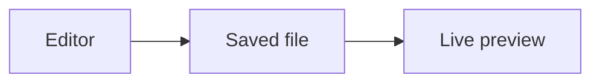

# Preview your first document

This tutorial creates a temporary Markdown document, opens it from Neovim, and verifies diagram zoom and live updates
from an external process. You finish by stopping the server and removing the temporary workspace.

## Before you start

Install media-glance.nvim and run `:MediaGlanceInstall` using the [installation instructions](../../README.md#install).
You need a browser and a shell on a supported macOS or Linux machine.

## Create a workspace

In a shell, run:

````bash
preview_workspace=$(mktemp -d)
cat > "$preview_workspace/README.md" <<'MARKDOWN'
# First preview

This document is saved on disk.


MARKDOWN
cd "$preview_workspace"
nvim README.md
````

Keep this shell open: its `preview_workspace` variable names only the temporary directory created for the tutorial.

## Open the saved file

Inside Neovim, run:

```vim
:MediaGlanceOpen
```

The browser shows **First preview**, the rendered flowchart, and the workspace explorer. The selected `README.md`
appears in the sidebar. The preview reads the file on disk; edits in an unsaved buffer are not visible yet.

## Enlarge the diagram

Click **+** beside the diagram. Only the diagram grows; the document text keeps its size. Click **Expand** to use
more screen space, scroll within the diagram if needed, then press Escape. Click **Fit** to return to its fitted size.

The same controls appear on previewed images and images embedded in Markdown.

## Verify an external update

Suspend Neovim with Ctrl-Z to return to the same shell. Its server stays alive while Neovim is suspended. Run:

```bash
printf '\nUpdated from the shell.\n' >> "$preview_workspace/README.md"
fg
```

Look at the browser again: **Updated from the shell.** appears without reopening the preview. A second editor or an
agent writing the saved file uses the same update path. Neovim's buffer may ask you to reload the externally changed
file; the browser reads the saved version independently.

## Stop and clean up

Inside Neovim, run:

```vim
:MediaGlanceClose
```

Select this temporary workspace and confirm the selection. The server stops; a list can include other sessions,
so choose the workspace you created. Exit Neovim, then remove only the tutorial directory:

```bash
cd "${TMPDIR:-/tmp}"
rm -r -- "$preview_workspace"
```

You have opened a focused document, enlarged a diagram, seen an external edit, and stopped an owned preview server.
Next, [choose a workspace and manage servers](../how-to/workspaces-and-servers.md), or inspect the
[configuration reference](../reference/configuration-and-api.md).
